# Corrección de Color y Constancia Cromática

Este proyecto implementa la corrección de color de imágenes tomadas bajo iluminaciones de color no estándar (amarillo, azul, cian, magenta, rojo y verde) para aproximarlas a una imagen tomada bajo luz blanca normal (referencia), utilizando una carta de calibración X-Rite ColorChecker Passport y una transformación lineal $3 \times 3$ calculada por mínimos cuadrados.

---

## 1. Fundamentos Matemáticos

### Modelo de formación del color

La respuesta en cada canal $k \in \{R, G, B\}$ de un sensor de cámara ante un punto de la escena depende del espectro de emisión de la fuente de luz $E(\lambda)$, de la reflectancia espectral de la superficie $R(\lambda)$ y de la sensibilidad espectral del sensor $S_k(\lambda)$ en el espectro visible $\Omega$:

$$C_k = \int_{\Omega} E(\lambda) R(\lambda) S_k(\lambda) \, d\lambda$$

Cuando la escena es iluminada por una luz de color diferente $E'(\lambda)$, la respuesta del sensor cambia a:

$$C'_k = \int_{\Omega} E'(\lambda) R(\lambda) S_k(\lambda) \, d\lambda$$

El objetivo de la constancia de color es estimar una transformación que mapee los valores observados $C'$ a los valores correspondientes bajo el iluminante de referencia $C$, eliminando la influencia de la luz coloreada.

### Trabajo en RGB lineal

Las cámaras digitales aplican curvas de tono y corrección gamma no lineal antes de guardar las imágenes en formato sRGB (JPEG). Debido a que la formación física de la imagen es lineal con respecto a la radiancia incidente, cualquier modelo de transformación cromática debe aplicarse estrictamente sobre valores radiométricos lineales.

La conversión de una componente $C_{\text{sRGB}} \in [0, 1]$ a su valor lineal $C_{\text{linear}} \in [0, 1]$ sigue el estándar IEC 61966-2-1:

$$C_{\text{linear}} = \begin{cases} 
\dfrac{C_{\text{sRGB}}}{12.92}, & C_{\text{sRGB}} \le 0.04045 \\[8pt]
\left(\dfrac{C_{\text{sRGB}} + 0.055}{1.055}\right)^{2.4}, & C_{\text{sRGB}} > 0.04045 
\end{cases}$$

Una vez aplicada la corrección en el espacio lineal, se vuelve al espacio sRGB para visualización y almacenamiento mediante la función inversa:

$$C_{\text{sRGB}} = \begin{cases} 
12.92 \cdot C_{\text{linear}}, & C_{\text{linear}} \le 0.0031308 \\[8pt]
1.055 \cdot C_{\text{linear}}^{1/2.4} - 0.055, & C_{\text{linear}} > 0.0031308 
\end{cases}$$

### Matriz 3x3 por mínimos cuadrados

Los filtros de color de los sensores reales no son independientes: las bandas de sensibilidad roja, verde y azul se solapan considerablemente. Por esta razón, una escala diagonal simple es insuficiente y se utiliza una matriz completa $\mathbf{M} \in \mathbb{R}^{3 \times 3}$ que modela la mezcla cruzada entre canales:

$$\mathbf{y}_i \approx \mathbf{M} \mathbf{x}_i$$

Sean $\mathbf{X} \in \mathbb{R}^{3 \times 24}$ la matriz que contiene como columnas los 24 colores lineales de la imagen a corregir, e $\mathbf{Y} \in \mathbb{R}^{3 \times 24}$ la matriz con los 24 colores lineales correspondientes de la imagen de referencia. El problema se plantea minimizando el error cuadrático en norma de Frobenius:

$$\min_{\mathbf{M}} \|\mathbf{Y} - \mathbf{M} \mathbf{X}\|_F^2$$

Expandiendo la función de costo:

$$\mathcal{J}(\mathbf{M}) = \operatorname{Tr}\left((\mathbf{Y} - \mathbf{M} \mathbf{X})(\mathbf{Y} - \mathbf{M} \mathbf{X})^T\right) = \operatorname{Tr}\left(\mathbf{Y}\mathbf{Y}^T - 2 \mathbf{M}\mathbf{X}\mathbf{Y}^T + \mathbf{M}\mathbf{X}\mathbf{X}^T\mathbf{M}^T\right)$$

Derivando con respecto a la matriz $\mathbf{M}$ e igualando a cero:

$$\nabla_{\mathbf{M}} \mathcal{J}(\mathbf{M}) = -2 \mathbf{Y} \mathbf{X}^T + 2 \mathbf{M} \mathbf{X} \mathbf{X}^T = \mathbf{0}$$

$$\mathbf{M} (\mathbf{X} \mathbf{X}^T) = \mathbf{Y} \mathbf{X}^T$$

Dado que los 24 colores abarcan todo el espacio tridimensional con rango completo, la matriz de correlación $\mathbf{X} \mathbf{X}^T \in \mathbb{R}^{3 \times 3}$ es invertible, obteniendo la solución analítica cerrada:

$$\mathbf{M} = \mathbf{Y} \mathbf{X}^T (\mathbf{X} \mathbf{X}^T)^{-1}$$

Para corregir la imagen completa, se multiplica cada píxel en RGB lineal por la matriz $\mathbf{M}$, se recorta al rango válido $[0, 1]$ para evitar valores negativos o sobreexposición, y se convierte de regreso a sRGB.

---

## 2. Ubicación de los Parches

Las fotos originales tienen la etiqueta EXIF de orientación (`Orientation: 6`), correspondiente a una rotación de 90° en sentido horario. Al cargarlas, se aplica `ImageOps.exif_transpose` para dejarlas en orientación vertical correcta.

La carta ColorChecker Passport abierta presenta en su página derecha la rejilla de 24 parches ($4 \text{ columnas} \times 6 \text{ filas}$):
- Esquina superior izquierda: parche verde-azulado (*bluish green*).
- Esquina superior derecha: parche negro (*black*).
- Esquina inferior izquierda: parche piel oscura (*dark skin*).
- Esquina inferior derecha: parche blanco (*white*).

Dado que la persona mueve levemente la mano entre tomas y las dominantes de color dificultan la detección automática por gradientes, se especifican en `corners_config.json` las coordenadas de tres esquinas clave $(\mathbf{p}_{TL}, \mathbf{p}_{TR}, \mathbf{p}_{BL})$ para cada foto. Las posiciones de los 24 centros se obtienen por interpolación de paralelogramo:

$$\mathbf{p}(r, c) = \mathbf{p}_{TL} + \frac{c}{3} (\mathbf{p}_{TR} - \mathbf{p}_{TL}) + \frac{r}{5} (\mathbf{p}_{BL} - \mathbf{p}_{TL})$$

Para cada parche se toma una ventana central de $31 \times 31$ píxeles y se calcula la mediana en RGB lineal, evitando ruidos y bordes del soporte plástico.

A continuación se muestra la verificación visual con los 24 parches ubicados en cada imagen:

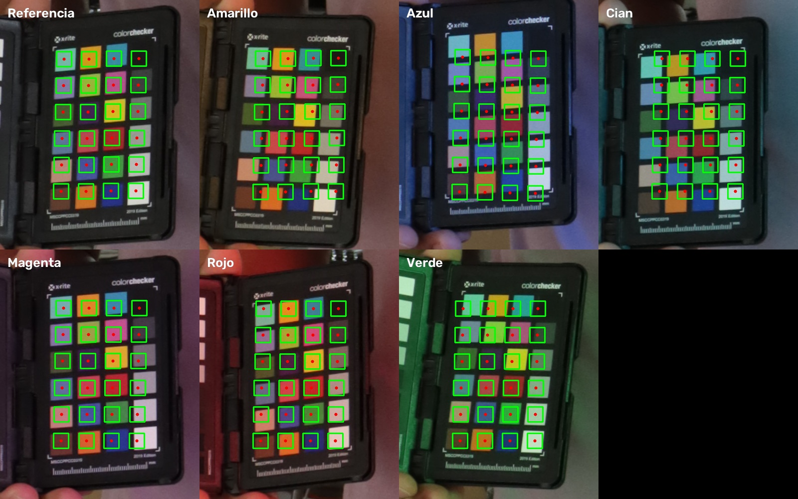

---

## 3. Resultados

### Referencia (Luz Blanca)
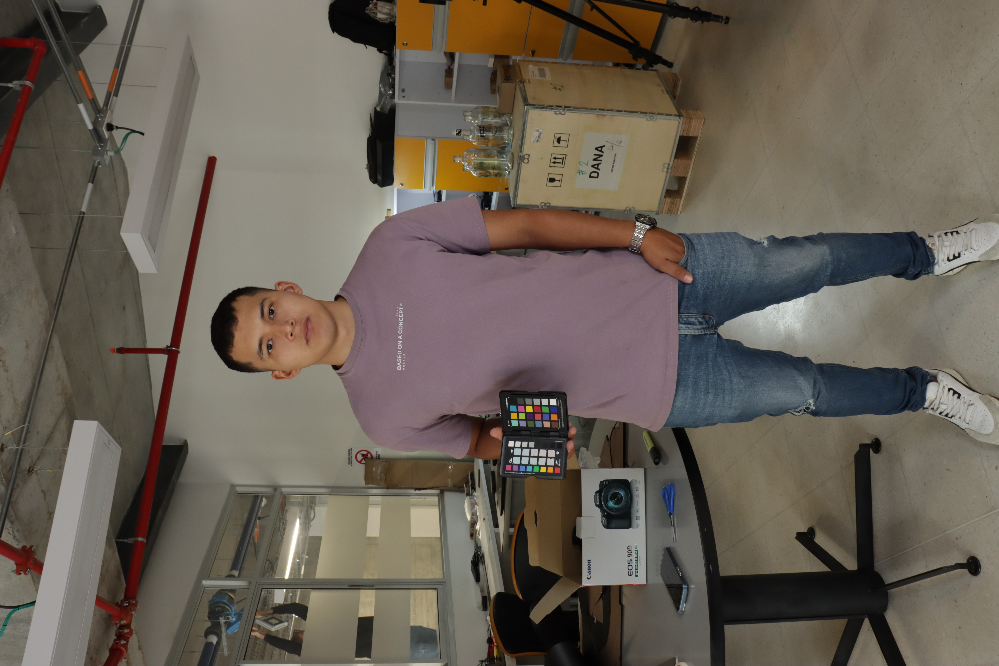

### Imágenes Originales vs Corregidas

| Color | Original | Corregida (Matriz 3x3) |
| :--- | :---: | :---: |
| **Rojo** | 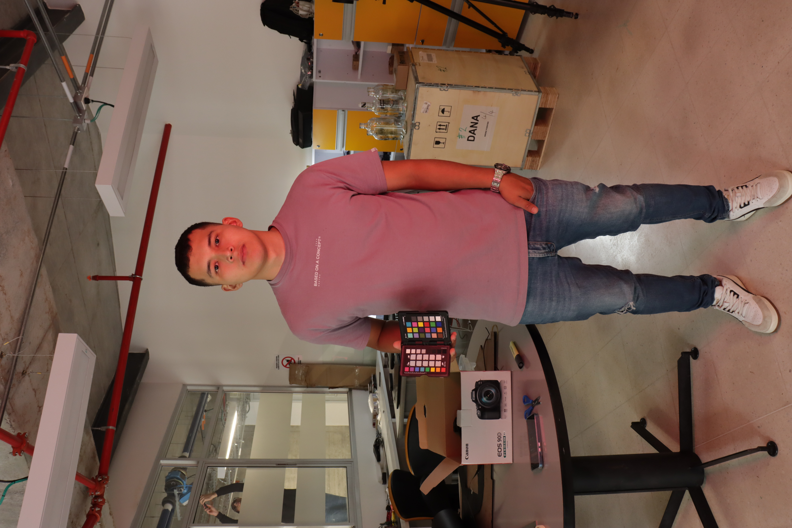 | 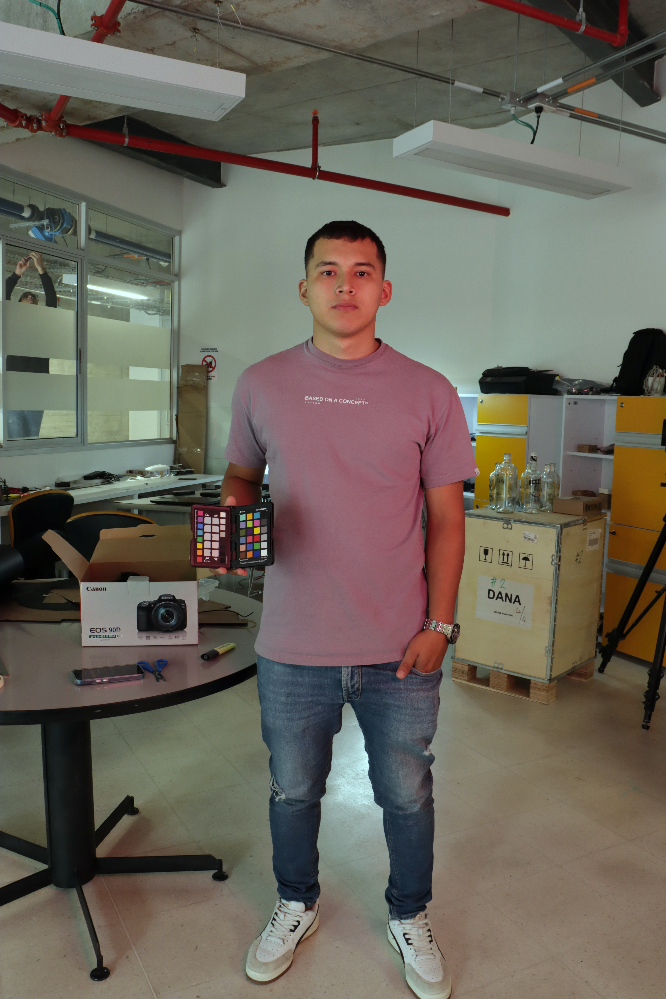 |
| **Verde** | 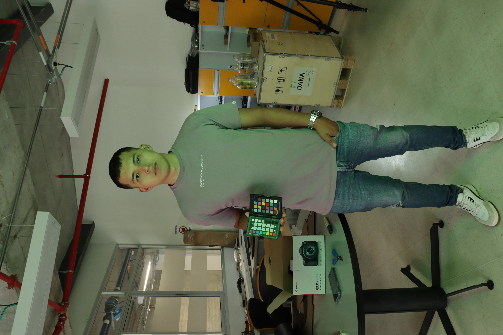 | 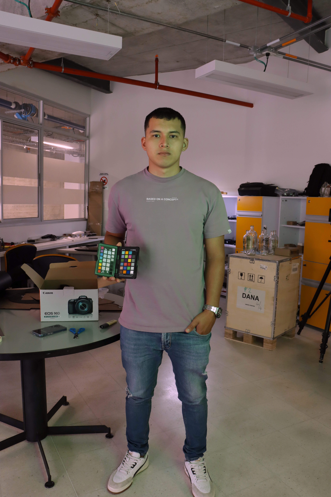 |
| **Magenta** | 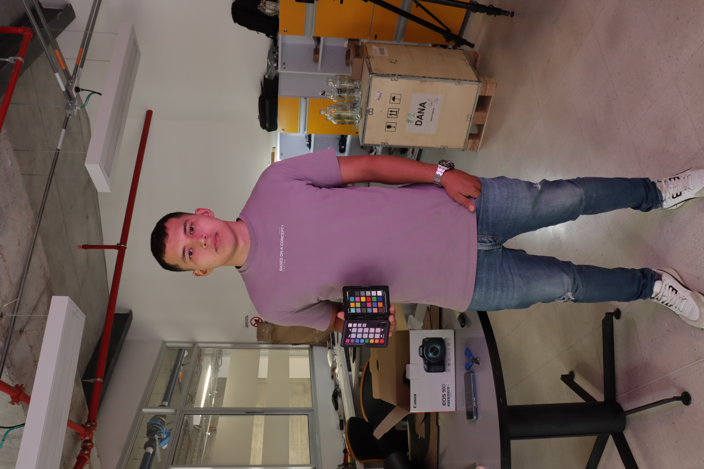 | 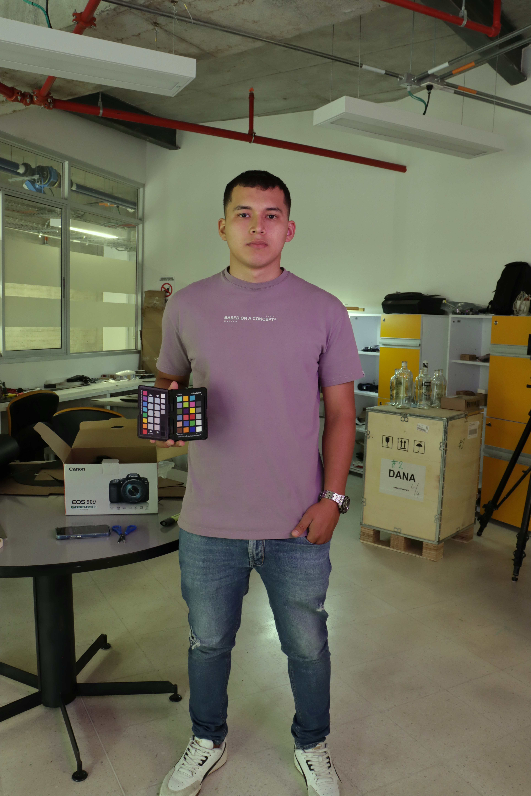 |
| **Amarillo** | 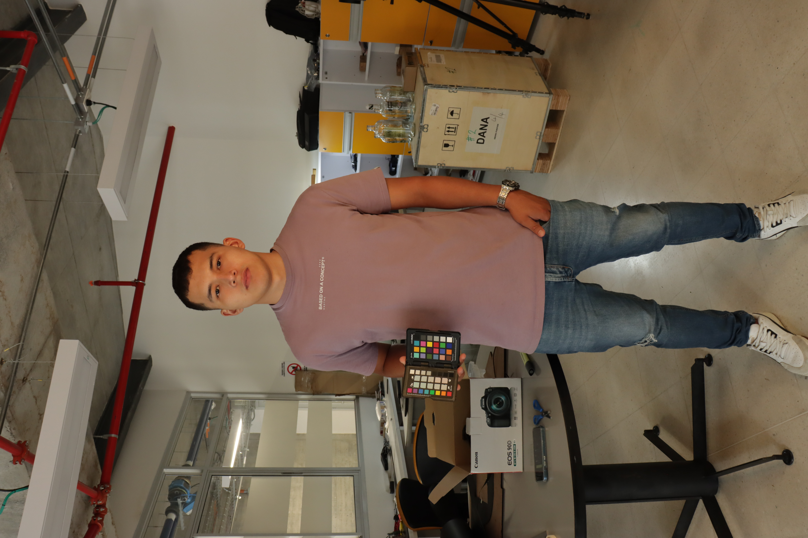 | 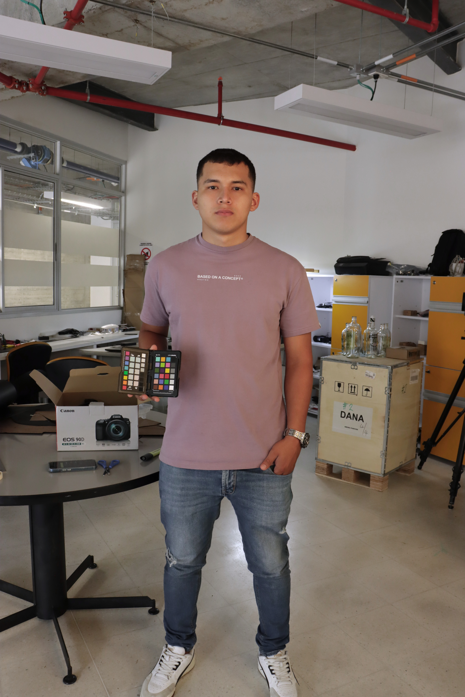 |
| **Azul** | 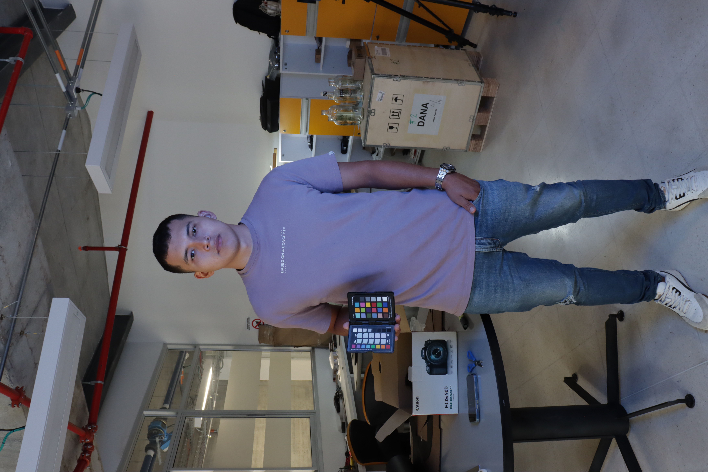 |  |
| **Cian** | 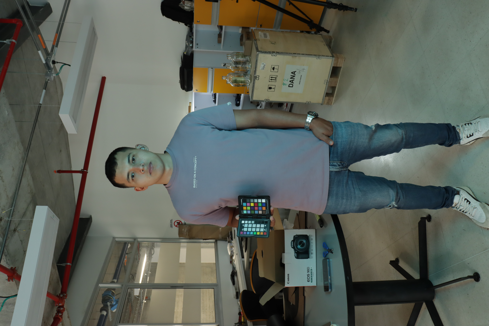 | 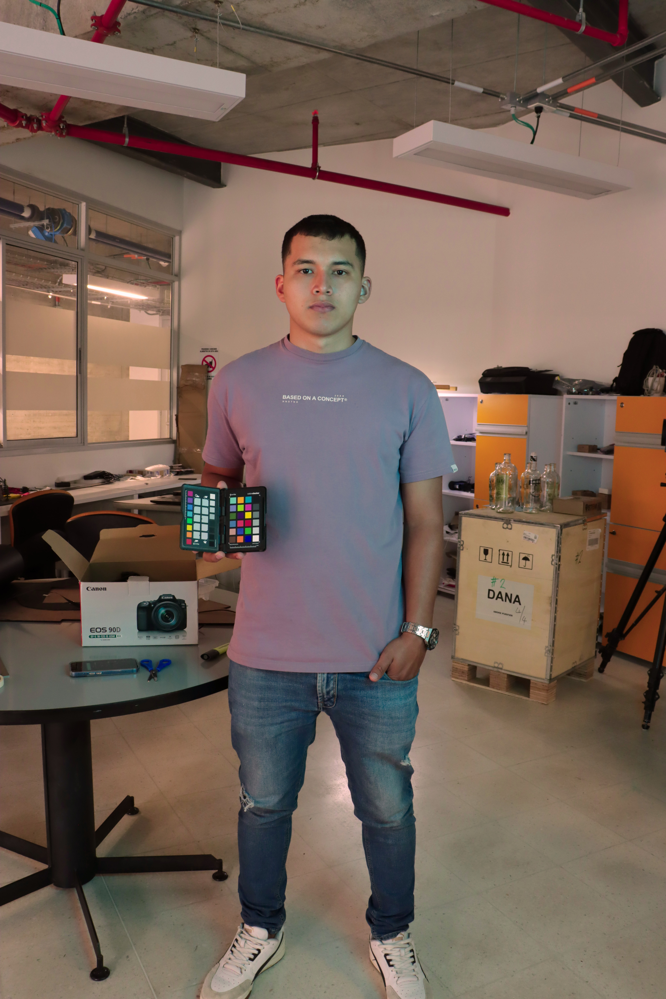 |

En los casos de luz roja, verde y magenta, la matriz elimina la dominante casi en su totalidad, restaurando el tono de la camiseta, la piel y el entorno a niveles muy cercanos a la referencia. En los casos de luz amarilla, azul y cian, la corrección neutraliza la dominante sobre la persona y la carta, aunque aparecen limitaciones asociadas a las condiciones de captura.
