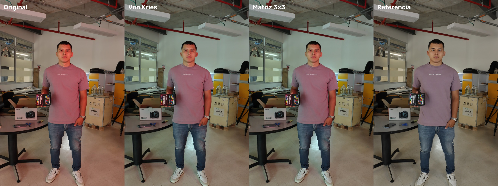
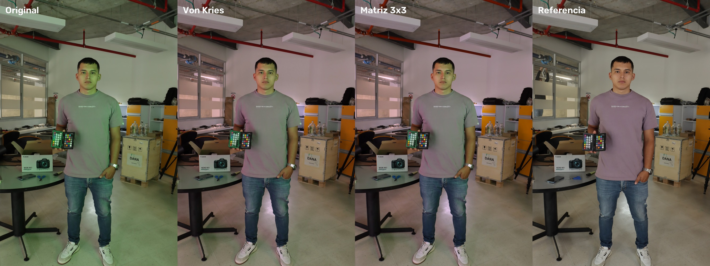
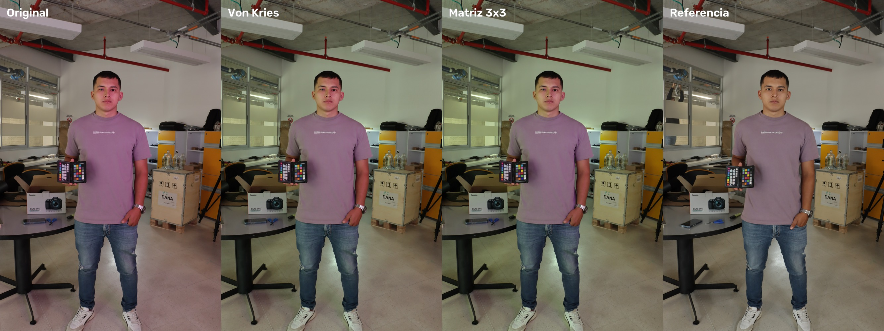
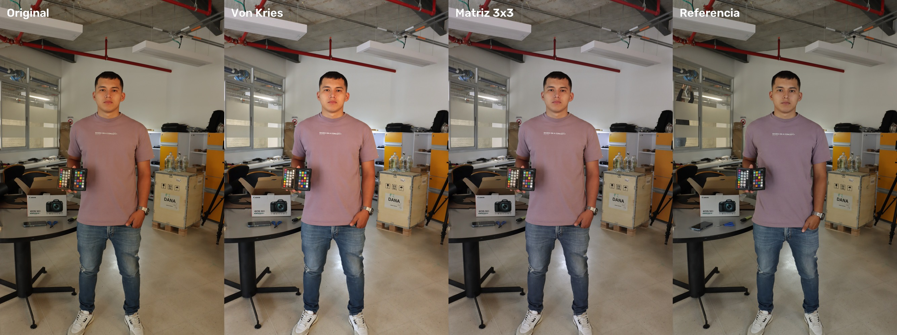
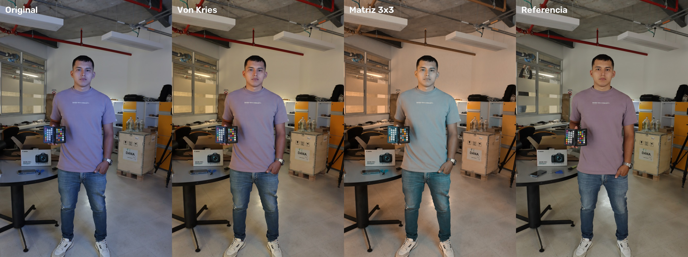
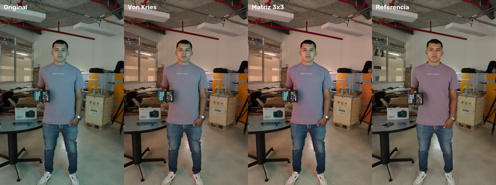

# Corrección de Color y Constancia Cromática con ColorChecker

Este proyecto implementa y compara dos métodos clásicos de constancia de color (adaptación diagonal de von Kries y corrección mediante matriz $3 \times 3$ por mínimos cuadrados) para calibrar imágenes tomadas bajo iluminaciones de color no estándar (rojo, verde, azul, magenta, cian y amarillo) frente a una imagen de referencia capturada con luz blanca normal.

---

## 1. Fundamentos Matemáticos

### Modelo de formación del color

La respuesta en cada canal $k \in \{R, G, B\}$ de un sensor de cámara digital ante un punto de la escena depende del espectro de emisión del iluminante $E(\lambda)$, de la reflectancia espectral de la superficie $R(\lambda)$ y de la sensibilidad espectral del sensor $S_k(\lambda)$ en el rango de longitudes de onda visible $\Omega$:

$$C_k = \int_{\Omega} E(\lambda) R(\lambda) S_k(\lambda) \, d\lambda$$

Cuando la escena es iluminada por una fuente de luz diferente $E'(\lambda)$, el valor registrado por el sensor pasa a ser:

$$C'_k = \int_{\Omega} E'(\lambda) R(\lambda) S_k(\lambda) \, d\lambda$$

El objetivo de la constancia de color computacional es encontrar un operador que mapee las respuestas observadas $C'$ a las respuestas esperadas bajo el iluminante canónico $C$, eliminando la influencia del color de la fuente de luz.

### Linealización de sRGB a RGB lineal

Las cámaras digitales aplican curvas tonales no lineales a los datos del sensor antes de guardar los archivos en formato sRGB (JPEG). Debido a que la formación física de la imagen es lineal con respecto a la radiancia incidente, cualquier modelo algebraico de transformación de color debe ejecutarse estrictamente sobre valores radiométricos lineales.

La conversión de una componente $C_{\text{sRGB}} \in [0, 1]$ a su valor lineal $C_{\text{linear}} \in [0, 1]$ sigue el estándar IEC 61966-2-1:

$$C_{\text{linear}} = \begin{cases} 
\dfrac{C_{\text{sRGB}}}{12.92}, & C_{\text{sRGB}} \le 0.04045 \\[8pt]
\left(\dfrac{C_{\text{sRGB}} + 0.055}{1.055}\right)^{2.4}, & C_{\text{sRGB}} > 0.04045 
\end{cases}$$

Una vez corregida la imagen en el espacio lineal, se vuelve al espacio sRGB para visualización y almacenamiento mediante la función inversa:

$$C_{\text{sRGB}} = \begin{cases} 
12.92 \cdot C_{\text{linear}}, & C_{\text{linear}} \le 0.0031308 \\[8pt]
1.055 \cdot C_{\text{linear}}^{1/2.4} - 0.055, & C_{\text{linear}} > 0.0031308 
\end{cases}$$

### Corrección von Kries (Línea base)

El modelo de von Kries postula que el cambio en la iluminación puede modelarse de forma simplificada mediante una escala independiente en cada uno de los tres canales cromáticos. En términos matriciales, esto equivale a una matriz diagonal:

$$\mathbf{c}_{\text{corr}} = \mathbf{D} \mathbf{c}_{\text{test}} = \begin{bmatrix} g_R & 0 & 0 \\ 0 & g_G & 0 \\ 0 & 0 & g_B \end{bmatrix} \begin{bmatrix} C_R \\ C_G \\ C_B \end{bmatrix}$$

Para estimar las ganancias $(g_R, g_G, g_B)$, se emplean los 6 parches de la escala de grises de la carta de calibración. Al ser parches neutros, su reflectancia es teóricamente plana en todo el espectro ($R(\lambda) \approx \rho$). Para cada canal $k$, se formula un problema de mínimos cuadrados unidimensional sobre los parches grises $i \in \{1, \dots, 6\}$:

$$\min_{g_k} \sum_{i=1}^{6} (g_k x_{i,k} - y_{i,k})^2$$

Derivando con respecto a $g_k$ e igualando a cero:

$$\frac{d}{dg_k} \sum_{i=1}^{6} (g_k x_{i,k} - y_{i,k})^2 = 2 \sum_{i=1}^{6} x_{i,k} (g_k x_{i,k} - y_{i,k}) = 0$$

$$g_k \sum_{i=1}^{6} x_{i,k}^2 = \sum_{i=1}^{6} x_{i,k} y_{i,k} \implies g_k = \frac{\sum_{i=1}^{6} x_{i,k} y_{i,k}}{\sum_{i=1}^{6} x_{i,k}^2}$$

### Corrección por matriz 3x3 (Mínimos Cuadrados)

Cuando las sensibilidades espectrales de los sensores $S_k(\lambda)$ son de banda ancha y se solapan entre sí, el modelo diagonal de von Kries resulta insuficiente. Una matriz completa $\mathbf{M} \in \mathbb{R}^{3 \times 3}$ permite modelar combinaciones cruzadas entre canales:

$$\mathbf{y}_i \approx \mathbf{M} \mathbf{x}_i$$

Sean $\mathbf{X} \in \mathbb{R}^{3 \times 24}$ la matriz que contiene como columnas los 24 colores lineales de la foto de prueba, e $\mathbf{Y} \in \mathbb{R}^{3 \times 24}$ la matriz con los 24 colores lineales correspondientes en la foto de referencia. Se plantea el problema de optimización en norma de Frobenius:

$$\min_{\mathbf{M}} \|\mathbf{Y} - \mathbf{M} \mathbf{X}\|_F^2$$

Expandiendo la función de costo:

$$\mathcal{J}(\mathbf{M}) = \operatorname{Tr}\left((\mathbf{Y} - \mathbf{M} \mathbf{X})(\mathbf{Y} - \mathbf{M} \mathbf{X})^T\right) = \operatorname{Tr}\left(\mathbf{Y}\mathbf{Y}^T - 2 \mathbf{M}\mathbf{X}\mathbf{Y}^T + \mathbf{M}\mathbf{X}\mathbf{X}^T\mathbf{M}^T\right)$$

Calculando el gradiente con respecto a la matriz $\mathbf{M}$ e igualándolo a la matriz nula:

$$\nabla_{\mathbf{M}} \mathcal{J}(\mathbf{M}) = -2 \mathbf{Y} \mathbf{X}^T + 2 \mathbf{M} \mathbf{X} \mathbf{X}^T = \mathbf{0}$$

$$\mathbf{M} (\mathbf{X} \mathbf{X}^T) = \mathbf{Y} \mathbf{X}^T$$

Dado que los 24 colores de la carta generan un espacio tridimensional de rango completo, la matriz de correlación $\mathbf{X} \mathbf{X}^T \in \mathbb{R}^{3 \times 3}$ es invertible, obteniendo la solución analítica cerrada:

$$\mathbf{M} = \mathbf{Y} \mathbf{X}^T (\mathbf{X} \mathbf{X}^T)^{-1}$$

Para corregir la imagen completa, se aplica la matriz $\mathbf{M}$ a cada píxel en RGB lineal, se acota el resultado al intervalo físico válido $[0, 1]$ para evitar subdesbordamiento o sobreexposición, y se convierte de nuevo a sRGB.

### Métrica de evaluación CIEDE2000 ($\Delta E_{00}$)

Para medir la diferencia de color percibida por el sistema visual humano, los valores sRGB de los parches se transforman al espacio CIELAB ($L^*, a^*, b^*$). La fórmula CIEDE2000 ($\Delta E_{00}$) corrige las no conformidades del espacio CIELAB original, considerando factores de compensación para luminosidad ($S_L$), croma ($S_C$), tono ($S_H$) y un término de rotación ($R_T$) para la región azul:

$$\Delta E_{00} = \sqrt{\left(\frac{\Delta L'}{k_L S_L}\right)^2 + \left(\frac{\Delta C'}{k_C S_C}\right)^2 + \left(\frac{\Delta H'}{k_H S_H}\right)^2 + R_T \left(\frac{\Delta C'}{k_C S_C}\right) \left(\frac{\Delta H'}{k_H S_H}\right)}$$

Un valor de $\Delta E_{00} \le 1.0$ representa una diferencia imperceptible para el ojo humano, mientras que diferencias en torno a $2.0 \sim 3.0$ se consideran aceptables en aplicaciones industriales y fotográficas.

---

## 2. Ubicación y Muestreo de los Parches

Las fotografías tomadas por la cámara contienen en sus metadatos la etiqueta EXIF de orientación (`Orientation: 6`), indicando una rotación de 90° en sentido horario. El código utiliza `PIL.ImageOps.exif_transpose` al cargar cada imagen para orientarla verticalmente antes de cualquier procesamiento.

En las imágenes orientadas, la carta de calibración X-Rite ColorChecker Passport se encuentra abierta en la mano de la persona. La página derecha contiene la rejilla clásica de 24 parches dispuesta en 4 columnas y 6 filas:
- Esquina superior izquierda (fila 0, col 0): parche verde azulado (bluish green).
- Esquina superior derecha (fila 0, col 3): parche negro (black).
- Esquina inferior izquierda (fila 5, col 0): parche piel oscura (dark skin).
- Esquina inferior derecha (fila 5, col 3): parche blanco (white).
- La columna derecha (col 3) contiene la serie de neutros desde negro hasta blanco.

Debido a que la persona mueve ligeramente la carta entre tomas y las condiciones de iluminación varían, los detectores automáticos basados en gradientes (`cv2.mcc`) no convergen de forma confiable sobre imágenes con fuerte dominante cromática. Por ello, se definen en el archivo `corners_config.json` las coordenadas de tres esquinas clave $(\mathbf{p}_{TL}, \mathbf{p}_{TR}, \mathbf{p}_{BL})$ para cada imagen. 

Las posiciones de los 24 centros se calculan mediante interpolación:

$$\mathbf{p}(r, c) = \mathbf{p}_{TL} + \frac{c}{3} (\mathbf{p}_{TR} - \mathbf{p}_{TL}) + \frac{r}{5} (\mathbf{p}_{BL} - \mathbf{p}_{TL}), \quad r \in \{0, \dots, 5\}, \; c \in \{0, \dots, 3\}$$

Para cada parche se toma una ventana central de $31 \times 31$ píxeles y se calcula la mediana en el espacio RGB lineal, eliminando cualquier efecto de ruido de sensor o bordes del soporte plástico.

A continuación se muestra la verificación visual con los 24 parches muestreados en cada una de las fotos:


---

## 3. Instrucciones de Uso

### Requisitos

Se requiere Python 3.10 o superior. Las dependencias necesarias están especificadas en `requirements.txt`:

```bash
pip install -r requirements.txt
```

### Estructura de archivos

```text
.
├── corners_config.json      # Coordenadas de las esquinas de la carta por foto
├── fotos/                   # Imágenes JPG originales (Referencia, Rojo, Verde, Azul, ...)
├── main.py                  # Script principal de procesamiento y evaluación
├── requirements.txt         # Dependencias del proyecto
├── resultados/              # Directorio de salida con imágenes corregidas y figuras
└── README.md                # Documentación del proyecto
```

### Ejecución

Para procesar todas las fotografías, generar las imágenes corregidas y calcular las métricas:

```bash
python main.py
```

El script imprimirá la tabla de métricas en consola y guardará en la carpeta `resultados/`:
- `{Color}_von_kries.jpg`: Imagen completa corregida mediante von Kries.
- `{Color}_matriz.jpg`: Imagen completa corregida mediante matriz $3 \times 3$.
- `comparativa_{Color}.jpg`: Cuadro comparativo (Original, Von Kries, Matriz $3 \times 3$, Referencia).
- `verificacion_parches.jpg`: Mosaico con los parches marcados en todas las imágenes.

---

## 4. Resultados Experimentales

La siguiente tabla resume los valores cuantitativos de error perceptual $\Delta E_{00}$ obtenidos al comparar los 24 parches de cada imagen contra los de la referencia tomada con luz blanca:

| Iluminación | Original ($\Delta E_{\text{medio}} / \Delta E_{\text{máx}}$) | Von Kries ($\Delta E_{\text{medio}} / \Delta E_{\text{máx}}$) | Matriz $3 \times 3$ ($\Delta E_{\text{medio}} / \Delta E_{\text{máx}}$) |
| :--- | :---: | :---: | :---: |
| **Amarillo** | 15.10 / 66.35 | 14.35 / 59.98 | **13.31** / 63.42 |
| **Azul** | 24.20 / 72.91 | 19.74 / 68.04 | **19.33** / **48.08** |
| **Cian** | 21.88 / 44.99 | 19.45 / 46.71 | **19.07** / **44.77** |
| **Magenta** | 8.23 / 15.73 | 3.38 / 6.85 | **2.22** / **5.12** |
| **Rojo** | 9.38 / 17.71 | 2.80 / 7.87 | **2.32** / **6.61** |
| **Verde** | 12.79 / 30.70 | 6.17 / 32.56 | **5.95** / **31.92** |

### Figuras Comparativas

#### Rojo
En la imagen con luz roja, la matriz $3 \times 3$ logra reducir el error medio a $\Delta E_{00} = 2.32$, logrando una tonalidad de piel y fondo prácticamente idéntica a la referencia.


#### Verde
La fuerte dominante verde se neutraliza efectivamente; la matriz $3 \times 3$ reduce el error medio de 12.79 a 5.95.


#### Magenta
Con luz magenta, la matriz $3 \times 3$ alcanza el menor error de todo el experimento con $\Delta E_{00} = 2.22$ en media y un máximo de solo 5.12.


#### Amarillo
En la toma amarilla, los canales rojo y verde están altamente estimulados mientras el canal azul presenta una señal muy débil en parches oscuros.


#### Azul
La iluminación azul presenta un alto contraste entre la zona frontal iluminada y las sombras. La matriz $3 \times 3$ logra disminuir el error máximo de 72.91 a 48.08.


#### Cian
En la foto cian, la combinación de fuentes de luz (LED cian frontal y tubos fluorescentes en el techo) genera una escena con iluminación mixta.


---

## 5. Limitaciones del Método y Análisis de Resultados

El análisis de los resultados cuantitativos y cualitativos permite identificar tres limitaciones físicas fundamentales:

1. **Compresión JPEG y no linealidades de la cámara**:
   Las fotos se capturaron en formato JPG. Esto implica que la cámara ya ejecutó internamente operaciones irreversibles como interpolación de mosaico de Bayer (demosaicing), compresión con pérdida, balance de blancos preliminar y mapeo de tonos. Aunque la función inversa de sRGB aproxima la respuesta a radiancia lineal, no puede recuperar la linealidad pura de un sensor RAW, limitando la precisión del modelo lineal.

2. **Luces muy saturadas y pérdida de señal (SNR bajo)**:
   Bajo iluminaciones de espectro estrecho o altamente saturadas (como amarillo, azul o cian), ciertos canales del sensor reciben casi nula energía. Por ejemplo, bajo luz amarilla los fotodiodos filtrados para azul captan muy pocos fotones en parches oscuros. Al aplicar la matriz inversa, la amplificación de ese canal multiplica principalmente ruido de cuantización y artefactos JPEG, lo que explica por qué fotos como Azul o Cian mantienen errores $\Delta E_{00}$ medios cercanos a 19, mientras que Rojo y Magenta bajan a valores de $\sim 2.3$.

3. **Iluminación espacialmente no uniforme y fuentes mixtas**:
   Tanto von Kries como la matriz $3 \times 3$ global asumen que la escena entera está iluminada por una única fuente homogénea $E(\lambda)$. En las fotos reales se observa claramente que el sujeto y la carta reciben luz coloreada proveniente de una fuente direccional frontal, mientras que el techo, el fondo y las partes superiores del laboratorio reciben luz blanca de tubos fluorescentes. Por esta razón, cuando la transformación calibra con precisión la carta de colores situada en la mano del sujeto, las paredes y elementos del fondo (que no estaban bajo la misma luz de color) adoptan un tinte complementario no deseado.
